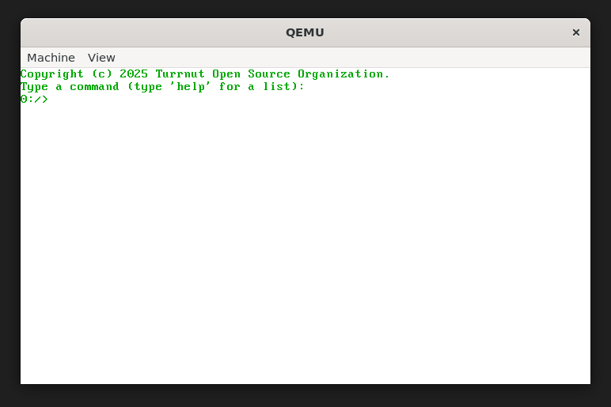

# Beacon

Beacon is an free, open source operating system created by the Turrnut Open Source Organization. The OS source code is distributed under the [GPL v3 License](COPYING).

### How to build & run

To build Beacon, you need to either be running Linux, or Windows with WSL (Windows Subsystem for Linux).
1. If you do not have all dependencies, please run `install-packages.sh` first.
2. Run `make compile`, and `os.iso` will be in the `out` folder in the current directory.
3. Burn to bootable media to run on real hardware (Any x86 cpu supporting Protected Mode (technical minimum i386, Pentium-class reccomended), at LEAST 16mb of RAM, and CGA or better Graphics are req'd; IDE HDD reccomended), or virtualize it using tools such as QEMU or VirtualBox. 
Example QEMU command: ```qemu-system-i386 -cdrom out/os.iso -hda [your image file here] -boot d -serial pty```

> [!IMPORTANT]
> If a valid FAT32 image file / Hard Disk is not attached, the OS may not boot or throw an error. The drive must also be IDE/PATA, it cannot be SATA/AHCI.
> It is also reccomended to use a burned CD/DVD, rather than a USB flash drive if attempting to boot on real hardware.

> [!NOTE]
> Hard Disks are officially supported on real hardware, but experimental. Your data may be lost, and we are not liable for any lost data caused by Beacon.

### Screenshots

The startup screen.


The Beacon Command Line Interface.


The included games.


A demo for math.c rendering a basic cube using text.
